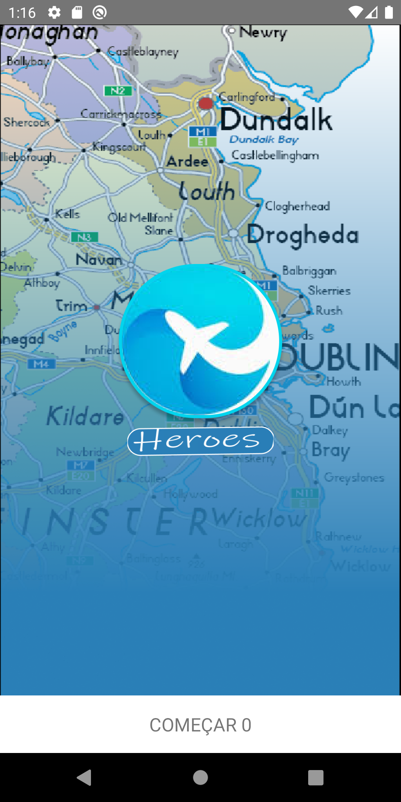

# Edição Trip Planner - Hands-on React Native
# --- DevPleno ---

## Descrição

### Criação de um aplicativo em React Native chamado TripPlanner, ministrado por Tulio Faria do DevPleno.

* Aula 01: 
    * Criação do Layout pelo Figma e inserção das imagens via código.
* Aula 02:
    * Criação das telas de navegação;
    * Import figuras exposrtadas do Figma;
    * Instalação e configuração da nevegação;
* Aula 03 -

#### Para me manter up to date.
